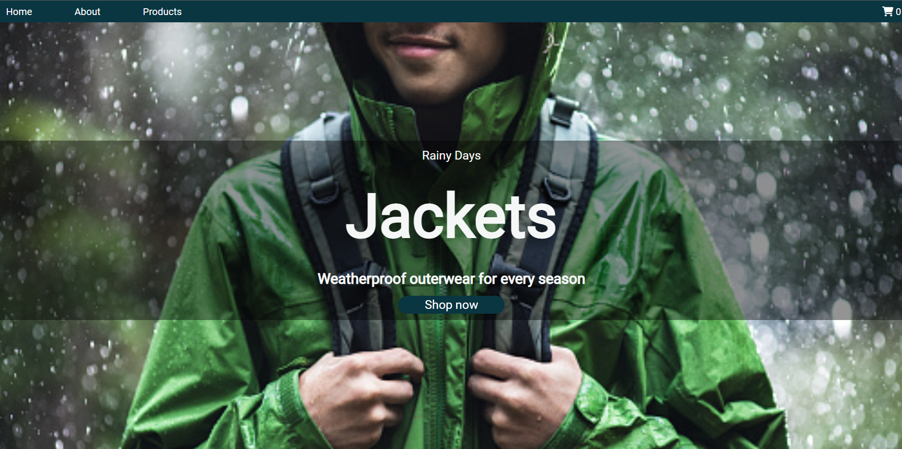
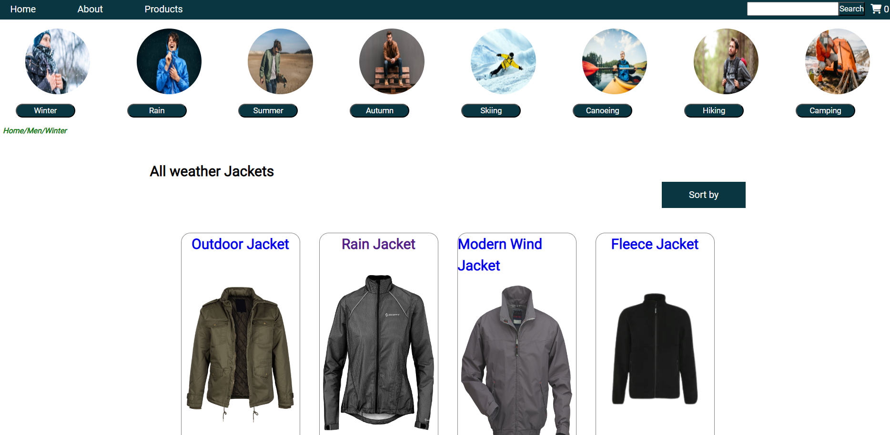
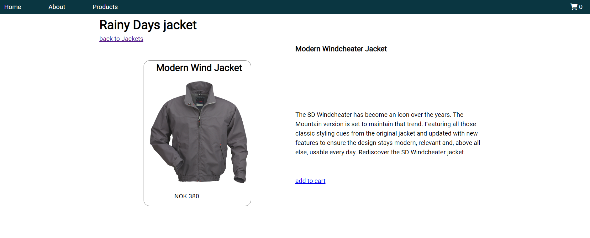

# CourseAssignment_CMS_rainydays






## Description
In this course assignment, we must use our knowledge of WordPress content management to setup an API for consumption in my Rainy days website project.


This repository consists of the following:

- Javascript Files
- Image Files
- HTML files
- CSS files


## Built With

- Javascript
- HTML
- CSS
- API from wordPress (https://rainydays.nyolosorio.no/wp-json/wc/store/products)

## Getting Started

### Installing


1. Clone the repo:

```bash
git clone git@github.com:nyolarraklay/CA_CMS_rainydays.git](https://github.com/nyolarraklay/CA_CMS_rainydays.git
```

2. Install the dependencies:

```
npm install
```

### Running


To run the app, run the following commands:

```bash
npm run start
```


## Contact


<h3 align="left">Connect with me:</h3>
<p align="left">
<a href="https://linkedin.com/in/linkedin.com/in/ernesto-jr-osorio-16b698248" target="blank"></a>
<a href="https://fb.com/https://www.facebook.com/nyol.osorio" target="blank"></a>
<a href="https://instagram.com/https://www.instagram.com/nyol.osorio" target="blank"></a>
</p>


